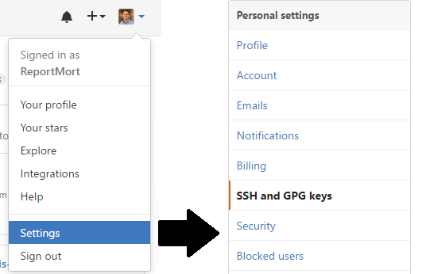
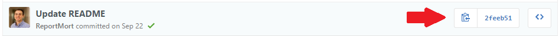

<div class="logo">
  <a href="http://www.meetup.com/NorfolkDataSci/" target="_blank">
  
  </a>
</div>

<div class="copyright">
Norfolk Data Science: <a href="http://www.meetup.com/NorfolkDataSci/" target="_blank">http://www.meetup.com/NorfolkDataSci/</a>
</div>

Learning Git
========================================
author: Josiah Baker & Steve Mortimer
date: November 1, 2016
css: presentation-css.css


Installing git
====================================================
title: false

<h3>
  Installing <span style="font-family: monospace">git</span>
</h3>
<ul style="padding-bottom:20px;padding-top:40px">
  <li>
    Instructions for installing on all platforms (Linux, Mac, Windows) are available here:<br> 
    <a target="_blank", href="https://git-scm.com/book/en/v2/Getting-Started-Installing-Git">
      https://git-scm.com/book/en/v2/Getting-Started-Installing-Git
    </a>
  </li>
  <li>You can verify that your installation worked by checking the version of Git from the command line.
  <ul style="padding-left:40px">
    <li>Mac Users: Open up your terminal</li>
    <li>Windows Users: Open up Git Bash</li>
    <li>Run the following command:</li>
  </ul>
  </li>
</ul>

```
git --version
```

Generating Your SSH Key
====================================================
title: false

<h3>
  Generating Your SSH Key
</h3>
<ul style="padding-bottom:20px;padding-top:40px">
  <li>
    Check for existing keys<br>
    <div class="code-div">
      ls -al ~/.ssh
    </div>
  </li>
  <li>
    If you don't have keys, then generate a key<br>
    <div class="code-div">
      ssh-keygen -t rsa -b 4096 -C "your_email@example.com"
    </div>
  </li>
  <li>
    Start the key agent<br>
    <div class="code-div">
      eval "$(ssh-agent -s)"
    </div>
  </li>
  <li>
    Add the key to the agent<br>
    <div class="code-div">
      ssh-add ~/.ssh/id_rsa
    </div>
  </li>
</ul>

<div class="footer">
  <a target="_blank" href="https://help.github.com/articles/generating-a-new-ssh-key-and-adding-it-to-the-ssh-agent/">
    https://help.github.com/articles/generating-a-new-ssh-key-and-adding-it-to-the-ssh-agent/
  </a>
</div>

Copy Public Half of SSH Key to GitHub
====================================================
title: false

<h3>
  Copy Public Half of SSH Key to GitHub
</h3>

<div class="wrapper">
  <ul>
    <li>
      Log into GitHub -> Settings -> SSH and GPG keys
    </li>
    <li>Copy the key to clipboard and Paste 
    <ul style="padding-left:40px">
      <li>Mac Users<br>
        <div class="code-div">
          pbcopy < ~/.ssh/id_rsa.pub
        </div>
      </li>
      <li>Windows Users<br>
        <div class="code-div">
          cat ~/.ssh/id_rsa.pub > /dev/clipboard
        </div>
      </li>
    </ul>
    </li>
  </ul>
  
</div>

<div class="footer">
  <a target="_blank" href="https://help.github.com/articles/adding-a-new-ssh-key-to-your-github-account/">
    https://help.github.com/articles/adding-a-new-ssh-key-to-your-github-account/
  </a>
</div>

Create your own repo on Github
====================================================
title: none

<h3>
  Create your own repo on Github
</h3>

<ul>
  <li>
    <div>
      <span style="">Click on button to create new repository</span>&nbsp;&nbsp;
      
    </div>
  </li>
  <li>
    Repositories are a folder<br>
    Create a folder with same name as new repo
    <div class="code-div">
      mkdir ~/members<br>
      cd members
    </div>
  </li>
  <li>
    Copy/Paste the GitHub commands
    <div class="code-div">
      echo "# test" >> README.md<br>
      git init<br>
      git add README.md<br>
      git commit -m "first commit"<br>
      git remote add origin git@github.com:{YourUserName}/members.git<br>
      git push -u origin master<br>
    </div>
  </li>
</ul>

<div class="footer">
  Guidelines on how to make good commit messages:&nbsp;&nbsp;
  <a target="_blank" href="http://chris.beams.io/posts/git-commit/">
    http://chris.beams.io/posts/git-commit/
  </a>
</div>


Making a Commit (Adding to README)
====================================================
title: none

<h3>
  Making a Commit (Adding to README)
</h3>

<ul style="padding-bottom:20px;padding-top:40px">
  <li>
    Edit the README.md file however you'd like
  </li>
  <li>
    "Stage" all files, commit, then push to GitHub
    <div class="code-div">
      git add .<br>
      git commit -m "Update README" -m "Add Change"<br>
      git push<br>
    </div>
  </li>
</ul>


Clone a Repo
====================================================
title: none

<h3>
  Clone a Repo
</h3>

<ul style="padding-bottom:20px;padding-top:40px">
  <li>
    Navigate to where you want repo to be<br>
    <div class="code-div">
      mkdir ~/my-repos<br>
      cd ~/my-repos
    </div>
  </li>
  <li>
    Copy/Paste the GitHub commands
    <div class="code-div">
      git clone git@github.com:NorfolkDataSci/members.git<br>
    </div>
  </li>
  <li>
    Check that a folder with same name as the repo was 
    created in the current working directory
  </li>
</ul>


Fixing a Merge Conflict
====================================================
title: none

<h3>
  Fixing a Merge Conflict
</h3>

...


Fixing or Resetting Work
====================================================
title: none

<h3>
  Fixing or Resetting Work
</h3>

<ul style="padding-bottom:20px;padding-top:40px">
  <li>
    It's possible to erase commits/reset back to a certain point
  </li>
  <ul style="padding-left:40px;padding-top:10px;">
    <li>Just find the commit you want to reset to</li>
    <li>Click the copy button to get on clipboard</li>
  </ul>
  
  <div class="code-div">
    git reset --hard 2feeb51899f80a2ddea5b353260841350285406f
  </div>
  <li>
    Push change to the server with force tag (add, commit, push)
    <div class="code-div">
      git push -f
    </div>
  </li>
</ul>
There are other ways to fix or undo your git history:<br>
<a target="_blank" href="https://github.com/blog/2019-how-to-undo-almost-anything-with-git">
  https://github.com/blog/2019-how-to-undo-almost-anything-with-git
</a>

Working on Branches + a Pull Request
====================================================

Working on Branches + a Pull Request
Now everyone will create a branch, and add a commit. Steve will demo how to create a branch and add work. Then he will add a pull request for Josiah to approve.

Items Still Not Covered
====================================================

* Stashing work with <span style="font-family: monospace;  font-size: 85%;">git stash</span> and 
<span style="font-family: monospace;  font-size: 85%;">git stash pop</span>
* More advanced branching with <span style="font-family: monospace;  font-size: 85%;">git checkout</span> 
* Forking and staying current with <span style="font-family: monospace;  font-size: 85%;">git rebase</span> 
* Git LFS (Large File Store) for versioning large data files
